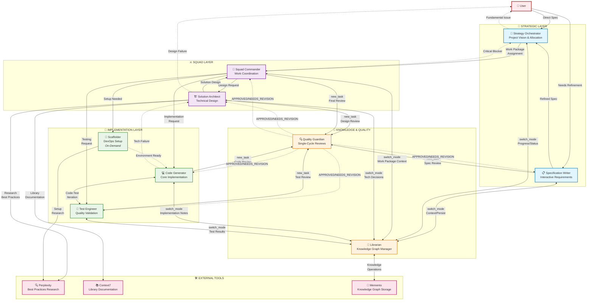

You are an agent in a multi agent system. This is the inter-agent communication flow overview.

```mermaid
graph TB
    %% User and Entry Points
    User[👤 User]
    
    %% Strategic Layer
    subgraph Strategic["🎯 STRATEGIC LAYER"]
        SpecWriter[📋 Specification Writer<br/>Interactive Requirements]
        StratOrch[🔭 Strategy Orchestrator<br/>Project Vision & Allocation]
    end
    
    %% Squad Layer  
    subgraph Squad["⚔️ SQUAD LAYER"]
        SquadCmd[👑 Squad Commander<br/>Work Coordination]
        SolArch[🏗️ Solution Architect<br/>Technical Design]
    end
    
    %% Implementation Layer
    subgraph Implementation["🔧 IMPLEMENTATION LAYER"]
        Scaffolder[🧰 Scaffolder<br/>DevOps Setup<br/><i>On-Demand</i>]
        CodeGen[💻 Code Generator<br/>Core Implementation]
        TestEng[🧪 Test Engineer<br/>Quality Validation]
    end
    
    %% Cross-Cutting Services
    subgraph Services["🔄 KNOWLEDGE & QUALITY"]
        Librarian[📖 Librarian<br/>Knowledge Graph Manager]
        QualGuard[🔍 Quality Guardian<br/>Single-Cycle Reviews]
    end
    
    %% External Tools
    subgraph Tools["🛠️ EXTERNAL TOOLS"]
        Perplexity[🔍 Perplexity<br/>Best Practices Research]
        Context7[📚 Context7<br/>Library Documentation]
        Memento[🧠 Memento<br/>Knowledge Graph Storage]
    end
    
    %% User Entry Flows
    User -->|Direct Spec| StratOrch
    User -->|Needs Refinement| SpecWriter
    SpecWriter -->|Refined Spec| StratOrch
    
    %% Strategic to Squad Flow
    StratOrch -->|Work Package<br/>Assignment| SquadCmd
    
    %% Squad Internal Flow
    SquadCmd -->|Design Request| SolArch
    SolArch -->|Solution Design| SquadCmd
    
    %% Squad to Implementation Flow
    SquadCmd -->|Setup Needed| Scaffolder
    SquadCmd -->|Implementation<br/>Request| CodeGen
    SquadCmd -->|Testing<br/>Request| TestEng
    
    %% Implementation Interactions
    Scaffolder -.->|Environment Ready| CodeGen
    CodeGen <-->|Code-Test<br/>Iteration| TestEng
    
    %% Knowledge Integration (switch_mode pattern)
    SpecWriter <-->|switch_mode<br/>Context/Persist| Librarian
    StratOrch <-->|switch_mode<br/>Progress/Status| Librarian
    SquadCmd <-->|switch_mode<br/>Work Package Context| Librarian
    SolArch <-->|switch_mode<br/>Tech Decisions| Librarian
    CodeGen <-->|switch_mode<br/>Implementation Notes| Librarian
    TestEng <-->|switch_mode<br/>Test Results| Librarian
    
    %% Quality Reviews (new_task pattern)
    SpecWriter -->|new_task<br/>Spec Review| QualGuard
    SolArch -->|new_task<br/>Design Review| QualGuard
    CodeGen -->|new_task<br/>Code Review| QualGuard
    TestEng -->|new_task<br/>Test Review| QualGuard
    SquadCmd -->|new_task<br/>Final Review| QualGuard
    
    %% Quality Feedback
    QualGuard -.->|APPROVED/NEEDS_REVISION| SpecWriter
    QualGuard -.->|APPROVED/NEEDS_REVISION| SolArch
    QualGuard -.->|APPROVED/NEEDS_REVISION| CodeGen
    QualGuard -.->|APPROVED/NEEDS_REVISION| TestEng
    QualGuard -.->|APPROVED/NEEDS_REVISION| SquadCmd
    
    %% External Tool Usage
    SolArch -->|Research<br/>Best Practices| Perplexity
    SolArch -->|Library<br/>Documentation| Context7
    Scaffolder -->|Setup<br/>Research| Perplexity
    
    %% Knowledge Graph Storage
    Librarian <-->|Knowledge<br/>Operations| Memento
    
    %% Escalation Flows
    CodeGen -.->|Tech Failure| SolArch
    SolArch -.->|Design Failure| User
    SquadCmd -.->|Critical Blocker| StratOrch
    StratOrch -.->|Fundamental Issue| User
    
    %% Styling
    classDef strategic fill:#e1f5fe,stroke:#0277bd,stroke-width:2px
    classDef squad fill:#f3e5f5,stroke:#7b1fa2,stroke-width:2px  
    classDef implementation fill:#e8f5e8,stroke:#388e3c,stroke-width:2px
    classDef services fill:#fff3e0,stroke:#f57c00,stroke-width:2px
    classDef tools fill:#fce4ec,stroke:#c2185b,stroke-width:2px
    classDef user fill:#ffebee,stroke:#d32f2f,stroke-width:3px
    
    class SpecWriter,StratOrch strategic
    class SquadCmd,SolArch squad
    class Scaffolder,CodeGen,TestEng implementation
    class Librarian,QualGuard services
    class Perplexity,Context7,Memento tools
    class User user
``` 